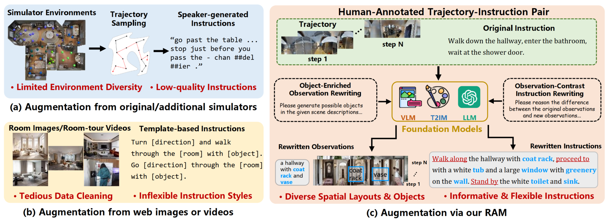

<div align="center">
<h2 align="center">
   <b>Unseen from Seen: Rewriting Observation-Instruction Using Foundation Models for Augmenting Vision-Language Navigation
   <!-- <br /> <font size=3>Under Review</font></b>  -->
</h2>
<div>
<a target="_blank">Ziming&#160;Wei</a><sup>1</sup>,
<a target="_blank">Bingqian&#160;Lin</a><sup>2</sup>,
<a target="_blank">Yunshuang&#160;Nie</a><sup>1</sup>,
<a target="_blank">Jiaqi&#160;Chen</a><sup>3</sup>,
<a target="_blank">Shikui&#160;Ma</a><sup>4</sup>,
<a target="_blank">Hang&#160;Xu</a><sup>5</sup>,
<a target="_blank" href="https://scholar.google.com/citations?user=voxznZAAAAAJ">Xiaodan&#160;Liang</a><sup>1&#9993</sup>
</div>
<sup>1</sup>Shenzhen Campus of Sun Yat-Sen University,&#160</span>
<sup>2</sup>Shanghai Jiao Tong University,&#160</span>
<sup>3</sup>The University of Hong Kong,&#160</span>
<sup>4</sup>Dataa Robotics,&#160</span>
<sup>5</sup>Huawei Noah’s Ark Lab</span>
<br />
<sup>&#9993&#160;</sup>Corresponding author&#160;&#160;</span>
<br/>
<div align="center">
    <a href="https://arxiv.org/abs/" target="_blank">
    </a>
</div>
</div>

______________________________________________________________________

<font size=2>
Data scarcity is a long-standing challenge in the Vision-Language Navigation (VLN) field, which extremely hinders the generalization of agents to unseen environments. Previous works primarily rely on additional simulator data or web-collected images/videos to improve the generalization. However, the simulator environments still face limited diversity, and the web-collected data often requires extensive labor to remove the noise. In this paper, we propose a Rewriting-driven AugMentation (RAM) paradigm for VLN, which directly creates the unseen observation-instruction pairs via rewriting human-annotated training data. Benefiting from our rewriting mechanism, new observation-instruction can be obtained in both simulator-free and labor-saving manners to promote generalization. Specifically, we first introduce Object-Enriched Observation Rewriting, where we combine Vision-Language Models (VLMs) and Large Language Models (LLMs) to derive rewritten object-enriched scene descriptions, enabling observation synthesis with diverse objects and spatial layouts via Text-to-Image Generation Models (T2IMs). Then, we propose Observation-Contrast Instruction Rewriting, which generates observation-aligned rewritten instructions by requiring LLMs to reason the difference between original and new observations. We further develop a mixing-then-focusing training strategy with a random observation cropping scheme, effectively enhancing data distribution diversity while suppressing augmentation data noise during training. Experiments on both the discrete environments (R2R, REVERIE, and R4R datasets) and continuous environments (R2R-CE dataset) show the superior performance and impressive generalization ability of our method.</font>



## :new: Updates
- [03/2025] [Arxiv paper](https://arxiv.org/abs/) released.

______________________________________________________________________


# Contents

- [Installation](#Installation)
- [Get VLN-RAM Data](#Get-VLN-RAM-Data)
  - [Generate Caption Data](#Generate-Caption-Data)
  - [Generate Panorama](#Generate-Panorama)
  - [Generate Instructions](#Generate-Instructions)
- [VLN Training](#VLN-Training)
- [Citation](#Citation)


# Installation

The environment installation of VLN-RAM follows that in [VLN-DUET](https://github.com/cshizhe/VLN-DUET).
1. Follow instructions [here](https://github.com/peteanderson80/Matterport3DSimulator) to install Matterport3D simulators.
2. Installation requirements for VLN training:
```setup
cd VLN-RAM
conda create --name vlnram python=3.8.5
conda activate vlnram
pip install -r requirements.txt
```


# Get VLN-RAM Data


## 1. Generate Caption Data
(1) Follow [this](https://github.com/peteanderson80/Matterport3DSimulator) to get the Matterport3D images. 

(2) Follow [this](https://github.com/xinyu1205/recognize-anything) to install the Tag2Text model and caption the panoramas by Tag2Text.

(3) You should fill in the missing paths in this code.
```
cd data_gen
python generate_caption_data.py
```


## 2. Generate Panorama
(1) Follow [this](https://github.com/omerbt/MultiDiffusion) to get the text2pano model.

(2) Follow [this](https://github.com/fuenwang/Equirec2Perspec) to get the discretization algorithm.

(3) You should fill in the missing paths in this code.
```
cd data_gen
python generate_panorama.py
```


## 3. Generate Instructions
(1) Get your own openai key.

(2) You should fill in the missing paths in this code.
```
cd data_gen
python instr_data.py
```


# VLN Training

1. Follow [this](https://github.com/cshizhe/VLN-DUET) to install our baseline method VLN-DUET.

2. Extract the CLIP ViT B/16 features or CLIP ViT L/14 features following [this](https://github.com/clip-vil/CLIP-ViL/tree/master/CLIP-ViL-VLN).

3. Pretrain and then finetune based on the scripts.

```
cd VLN-DUET
cd pretrain_src
bash run_r2r.sh
bash run_reverie.sh

cd map_nav_src
bash scripts/run_r2r.sh
bash scripts/run_reverie.sh
bash scripts/run_r4r.sh
```


# Citation
If you find this work useful, please consider citing:
```bibtex

```


# Acknowledgement
Some of the codes are built upon [VLN-DUET](https://github.com/cshizhe/VLN-DUET), [Equirec2Perspec](https://github.com/fuenwang/Equirec2Perspec), [Tag2Text](https://github.com/xinyu1205/recognize-anything) and [MultiDiffusion](https://github.com/omerbt/MultiDiffusion). Thanks them for their great works!


